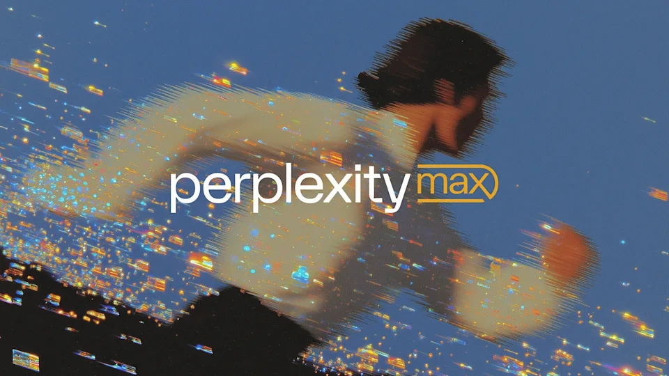

# Perplexity Max 订阅服务：每月 200 美元，顶级 AI 模型无限用

---

对于重度 AI 使用者来说，日常工作中频繁碰到用量限制是件挺烦人的事。你可能正在处理一个复杂项目，突然发现今天的高级模型额度用完了，只能等到明天重置。Perplexity 显然注意到了这个痛点,推出了全新的 Max 订阅方案——承诺让你彻底告别用量焦虑，随时调用最先进的 AI 模型。

---

## 什么是 Perplexity Max?

最近不少朋友通过 HKT 领到了 Perplexity Pro 的免费年度试用，体验过后大概能感受到这类 AI 工具在日常工作中的价值。但对于那些需求量更大的用户——比如研究人员、内容创作者或开发者——Pro 版本的用量限制可能还是不够用。

Perplexity Max 就是为这群人准备的。每月 200 美元的定价,直接对标 Google AI Ultra 和 OpenAI ChatGPT Pro 这些高端订阅服务。价格不便宜,但换来的是实实在在的"无限制"使用体验。

## Max 订阅能给你什么?

**无限使用顶级模型**

这是 Max 最核心的卖点。你可以无上限地调用 OpenAI 的 o3-pro 和 Claude Opus 4 这些最新模型,而且享有优先访问权。不用再盯着每日额度倒计时,想用就用。

**Labs 功能全面开放**

Labs 是 Perplexity 的实验性功能集合,能自动生成试算表、撰写报告、将数据可视化,甚至自动编写和执行代码。Max 用户可以无限次使用这些功能,对于需要频繁处理数据和生成内容的人来说相当实用。

如果你正在寻找一个既能提供顶级 AI 能力、又不用担心用量限制的解决方案,👉 [Perplexity Pro年费成品号，24H自动发货，365天质保，让你的 AI 使用体验更省心](https://shaoyumi.com/buy/64) 也是个值得考虑的选择。

**优先体验 Comet 浏览器**

Perplexity 正在开发自己的 AI 浏览器 Comet,Max 用户可以抢先体验。虽然目前关于这款浏览器的细节还不多,但考虑到 Perplexity 在 AI 搜索领域的积累,这个浏览器应该会有些独特的功能。

**专属技术支持**

遇到问题时有专门的技术团队帮你解决,不用在社区论坛里碰运气。对于将 AI 工具深度整合进工作流程的用户来说,这种支持很重要。

## 为什么推出这么贵的订阅?

说实话,每月 200 美元的订阅费不是普通用户能轻松接受的。但从 Perplexity 的财务状况来看,这个定价有其必然性。

报道显示,Perplexity 在 2024 年通过 Pro 订阅获得了 3400 万美元收入,但同期在云端服务器和向 OpenAI、Anthropic 购买 AI 模型 API 的成本就花了 6500 万美元。算下来,光靠现有的订阅模式是入不敷出的。

推出 Max 这种高价订阅,本质上是在开拓愿意为"无限使用"买单的客户群。对于那些每天大量使用 AI、把它当作核心生产工具的人来说,200 美元换来的效率提升可能远超这个成本。

## 适合谁用?

坦白讲,Max 不是给普通用户准备的。如果你只是偶尔用 AI 写写邮件、做做总结,Pro 版本甚至免费版就够了。

但如果你是:
- 需要频繁调用最新模型做研究或开发的技术人员
- 每天要处理大量内容生成和数据分析的创作者
- 把 AI 工具深度整合进工作流程、用量需求巨大的团队成员

那 Max 可能真的值得考虑。毕竟时间就是金钱,如果因为用量限制导致工作中断或降级使用旧模型,损失的可能远不止 200 美元。

## 未来会有企业版吗?

Perplexity 已经表示,未来会推出面向企业客户的 Max 级别方案。这很好理解——企业用户往往有更大的用量需求和预算,而且更看重稳定性和支持服务。

对于想要在团队内部推广 AI 工具的企业来说,等等企业版可能更合适。毕竟企业需要的不只是功能,还有账户管理、使用数据统计、安全合规等配套能力。

---

## 结语

Perplexity Max 的出现,标志着 AI 订阅服务正在向更加细分的市场发展。200 美元的定价看似高昂,但对于真正的重度用户来说,无限使用顶级模型带来的价值可能远超成本。当然,如果你还在评估自己的使用需求,👉 [Perplexity Pro年费成品号提供了更经济的入门选择，24H自动发货，365天质保](https://shaoyumi.com/buy/64),可以先从这里开始体验。AI 工具的选择,最终还是要看它能否真正解决你的实际问题。
